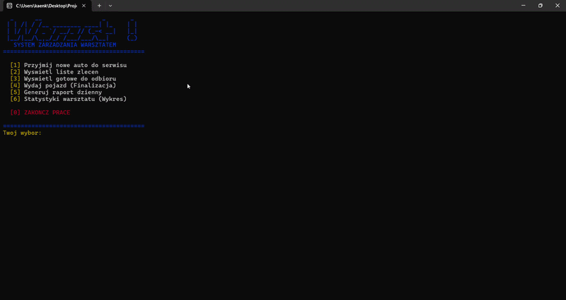

# 🔧 Car Workshop Management System

## Project for one of my classes

  
  
<i>Real-time terminal execution of the Workshop Management System.</i>

## 🚀 Key Technical Features

* **Advanced OOP Architecture:** Heavily relies on polymorphism, abstraction (`IPojazd`), and inheritance to handle different vehicle behaviors (Cars, Motorcycles, Trucks) cleanly without massive `if/else` chains.
* **Smart Memory Management:** Complete elimination of raw pointers. Uses `std::unique_ptr` and standard containers (`std::vector`, `std::map`) to guarantee leak-free memory handling during active and archived work orders.
* **Dynamic Pricing Engine:** Reads and applies real-time cost and time multipliers from external config files (`marki.txt`), simulating a scalable database approach.
* **Automated Data Persistence:** Features a daily reporting module that generates formatted `.txt` summaries including revenue, processed vehicles, and workshop efficiency metrics.

##
